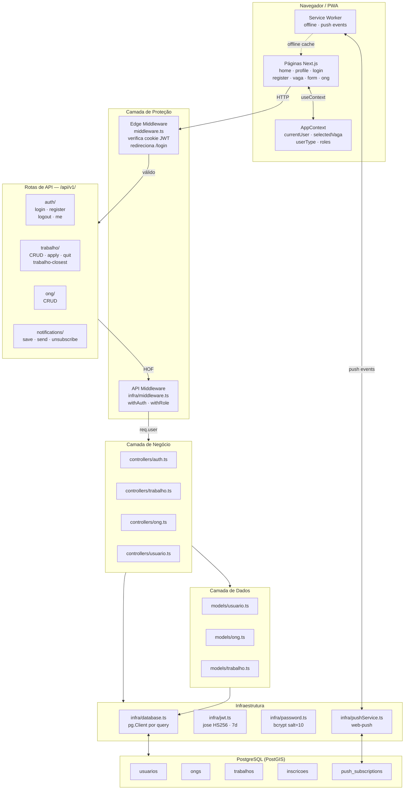
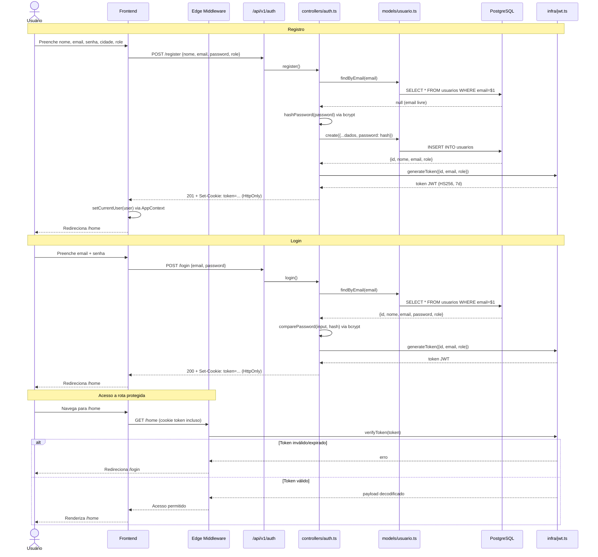
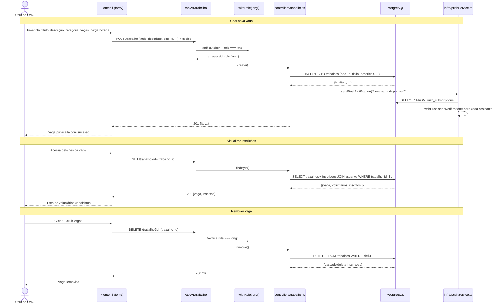
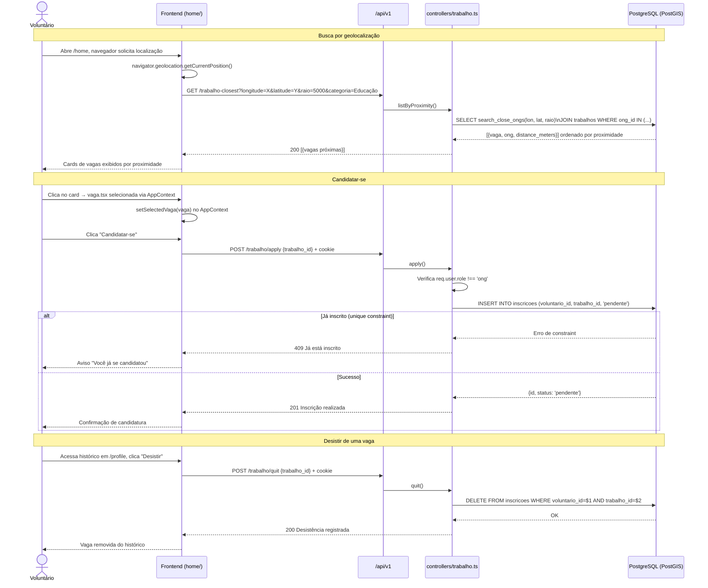
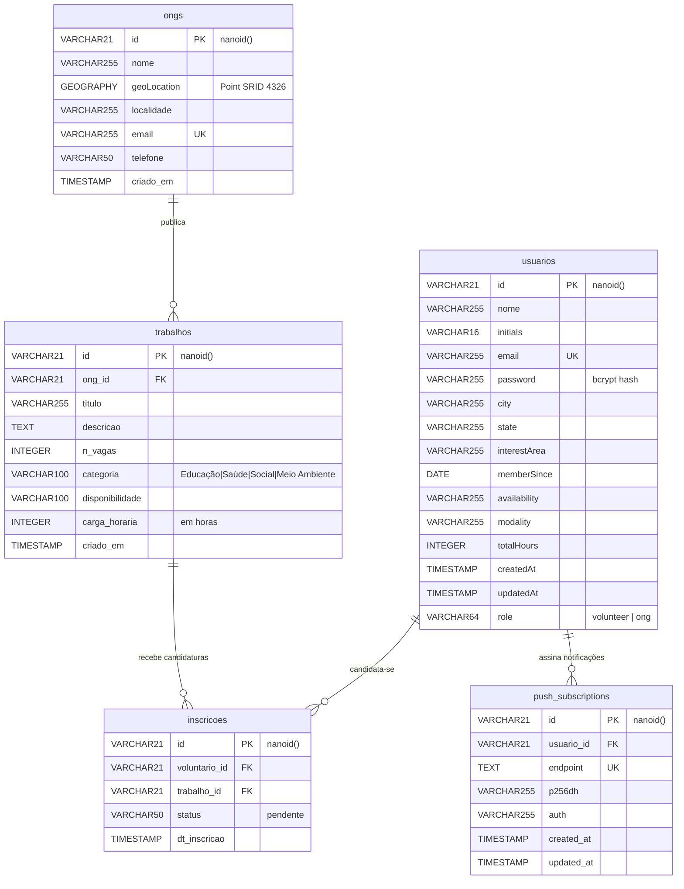
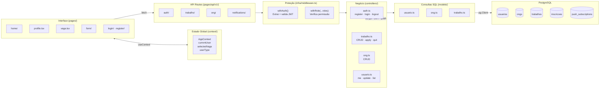
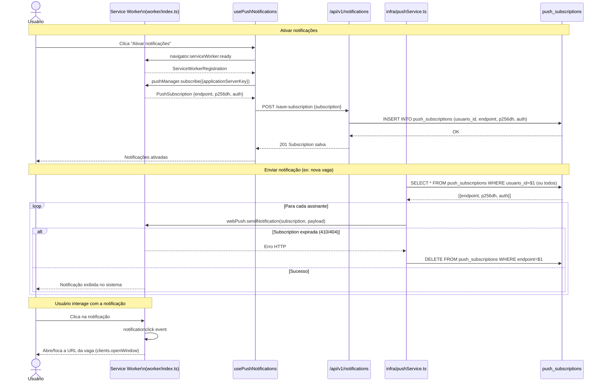
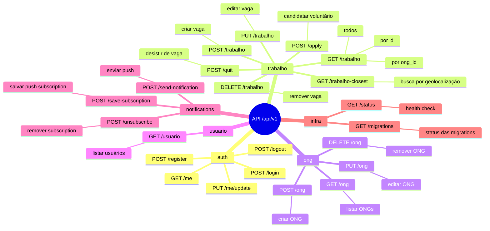

# VoluntariApp — Documentação do Projeto

## 1. Contexto e Motivação

### 1.1 O Problema

A sociedade civil organizada enfrenta hoje um problema estrutural: **a falta de informação centralizada sobre causas sociais gera invisibilidade e desconfiança em projetos que dependem de voluntários**. ONGs e projetos sociais existem em grande número, mas a dificuldade em comunicar necessidades de forma ágil e confiável impede que pessoas dispostas a ajudar encontrem onde e como contribuir.

Este projeto tem como base conceitual a **ODS 17 — Parcerias para a Implementação dos Objetivos**, da Agenda 2030 da ONU, que reconhece que o alcance dos demais objetivos de desenvolvimento sustentável depende de parcerias efetivas entre setores público, privado e sociedade civil.

### 1.2 Evidências do Problema — Pesquisa com ONGs

Para validar o problema, foram realizadas entrevistas com representantes de ONGs. Os principais achados:

| Tema | Dor Identificada |
|------|-----------------|
| **Captação de voluntários** | Processo manual, levando 1 a 2 semanas por ação; encontrar pessoas dispostas a trabalhar sem remuneração é o maior desafio |
| **Divulgação** | Dependência de Instagram e boca a boca; eficaz para alcance geral, mas sem garantia para urgências |
| **Gestão do tempo** | Parcela significativa do tempo da equipe gasta com recrutamento em detrimento da missão principal |
| **Registro de necessidades** | Utilização de planilhas e documentos Word/Docs, sem ferramenta adequada |

### 1.3 Oportunidade

A identificação dessas dores aponta para uma oportunidade clara: criar uma plataforma digital que **centralize, organize e torne visíveis** as oportunidades de voluntariado, reduzindo o custo operacional das ONGs na captação e possibilitando que voluntários encontrem causas alinhadas ao seu perfil e disponibilidade.

---

## 2. Objetivo do Projeto

O **VoluntariApp** é uma plataforma web progressiva (PWA) que conecta voluntários a organizações da sociedade civil (ONGs), atuando como intermediária no processo de recrutamento voluntário.

### Objetivos específicos

- Oferecer um catálogo centralizado de vagas de voluntariado com filtros por categoria, modalidade e geolocalização
- Permitir que ONGs publiquem e gerenciem suas oportunidades de trabalho voluntário
- Facilitar o processo de candidatura por parte dos voluntários
- Enviar notificações em tempo real sobre novas vagas e atualizações via push notifications
- Funcionar offline como PWA, garantindo acesso mesmo em condições de conectividade limitada

### Perfis de usuário

| Perfil | Capacidades |
|--------|------------|
| **Voluntário** (`volunteer`) | Cadastrar perfil, buscar vagas por localização/categoria, candidatar-se, acompanhar histórico |
| **ONG** (`ong`) | Cadastrar organização, publicar vagas, visualizar candidatos inscritos, gerenciar oportunidades |

---

## 3. Arquitetura Geral do Sistema

### Stack tecnológica

| Camada | Tecnologia |
|--------|-----------|
| Frontend | Next.js 13 (Pages Router) + TypeScript + Ant Design |
| Backend | Next.js API Routes (serverless) |
| Banco de dados | PostgreSQL + PostGIS (geolocalização) |
| Autenticação | JWT via `jose` — armazenado em cookie HttpOnly |
| Criptografia | bcrypt (senhas) |
| PWA / Push | `next-pwa` + Web Push API (`web-push`) |
| Migrations | `node-pg-migrate` |
| Deploy | Vercel (frontend + API) + Docker (banco local) |

---

## 4. Fluxo de Autenticação

---

## 5. Fluxo da ONG — Publicar e Gerenciar Vagas

---

## 6. Fluxo do Voluntário — Buscar e Candidatar-se

---

## 7. Modelo de Dados

---

## 8. Distribuição de Responsabilidades por Camada

---

## 9. Fluxo de Notificações Push (PWA)

---

## 10. Mapa de Rotas da API

---

## 11. Decisões Técnicas Relevantes

| Decisão | Escolha | Justificativa |
|---------|---------|--------------|
| ORM | Nenhum — SQL direto via `pg` | Controle total sobre queries, sem overhead de abstração |
| Conexão DB | Novo `pg.Client` por query | Simplicidade em ambiente serverless/Vercel |
| Auth storage | Cookie HttpOnly | Proteção contra XSS; não acessível via JavaScript |
| IDs | `nanoid()` (21 chars) | Mais curto que UUID, colision-safe, URL-safe |
| Geolocalização | PostGIS + função SQL `search_close_ongs` | Queries de proximidade nativas no banco, sem lib externa |
| Offline | PWA Service Worker | Funcionalidade básica sem conexão, cache de assets |
| Roles | Apenas `volunteer` e `ong` no JWT | Simples e suficiente para o escopo atual |
