# Plano de Negócios Detalhado — VoluntariApp

> Versão: 1.0 | Data: Maio 2026 | Baseado no Business Model Canvas do VoluntariApp

---

## Sumário Executivo

O **VoluntariApp** é uma plataforma digital multi-sided que conecta três grupos interdependentes: voluntários individuais, ONGs e empresas privadas com agenda ESG. Ao atuar como intermediária, a plataforma resolve um problema estrutural: **a fragmentação do ecossistema de impacto social no Brasil**, onde voluntários não encontram oportunidades, ONGs perdem semanas captando pessoas e empresas não têm canal confiável para direcionar verba.

O modelo de receita é sustentado pela **comissão sobre editais** (transação financeira empresa → ONG), complementado por um **plano premium para ONGs**. Voluntários têm acesso gratuito, garantindo volume de usuários e efeito de rede.

A plataforma está ancorada na **ODS 17 — Parcerias para a Implementação dos Objetivos** (Agenda 2030 da ONU), o que confere credibilidade institucional e diferencial de posicionamento frente a iniciativas similares.

---

## Fluxo Geral da Plataforma

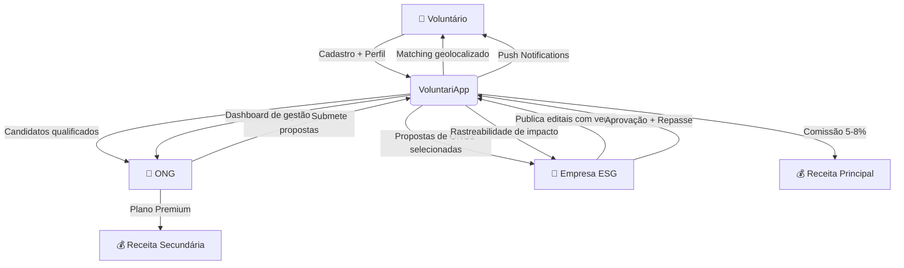

---

## 1. Segmentos de Clientes

> *Quem você ajuda?*

O VoluntariApp opera em um modelo de **plataforma multi-sided** (mercado multilateral), onde o valor gerado para cada segmento depende da massa crítica dos demais. O crescimento de um segmento impulsiona os outros em efeito cascata.

---

### 1.1 Voluntários Individuais

**Perfil demográfico**

| Característica | Dado |
|---|---|
| Faixa etária principal | 18–35 anos (geração Z e Millennials) |
| Escolaridade | Ensino superior completo ou em curso |
| Renda | Classe B/C |
| Localização | Grandes centros urbanos (inicial); expansão para médias cidades |
| Dispositivo | Mobile-first (smartphones Android e iOS) |

**Persona primária — "A Estudante Engajada"**
> **Mariana, 22 anos, estudante de Pedagogia em São Paulo.** Quer fazer diferença, já fez 2 ações voluntárias, mas encontrou as oportunidades apenas por Instagram de amigos. Não sabe quais ONGs atuam perto de casa. Tem disponibilidade nos fins de semana e prefere causas de Educação e Infância. Usa o celular para tudo.

**Persona secundária — "O Profissional com Propósito"**
> **Rafael, 31 anos, analista de TI em Belo Horizonte.** Quer colocar suas habilidades técnicas a serviço de uma causa. Já tentou contatar ONGs diretamente, mas não teve retorno. Valoriza experiências organizadas, com impacto mensurável e que possam compor seu portfólio LinkedIn.

**Dores identificadas**
- Falta de centralização: oportunidades espalhadas em grupos, redes sociais e sites desatualizados
- Incompatibilidade de localização e horário: vagas distantes ou em horários inacessíveis
- Falta de feedback: candidaturas sem retorno, processo pouco transparente
- Baixa confiança: dificuldade em verificar a seriedade das organizações

**Ganhos esperados**
- Encontrar vagas próximas em menos de 5 minutos
- Receber alertas automáticos de novas oportunidades compatíveis
- Ter histórico pessoal consolidado de horas e causas apoiadas

---

### 1.2 ONGs (Organizações Não Governamentais)

**Perfil organizacional**

| Característica | Dado |
|---|---|
| Porte | Pequeno e médio (2–50 colaboradores) |
| Receita anual | R$ 50 mil – R$ 5 milhões |
| Área de atuação | Educação, Saúde, Social, Meio Ambiente, Cultura |
| Estrutura digital | Limitada — WhatsApp, Instagram e planilhas |
| Principal desafio | Captação de voluntários e financiamento |

**Persona primária — "A Coordenadora Sobrecarregada"**
> **Cláudia, 38 anos, coordenadora de projetos na ONG "Mãos que Transformam" em Campinas.** Gerencia 12 voluntários fixos e precisa recrutar 20 novos por ação. O processo atual envolve posts no Instagram, formulários do Google e triagem manual por WhatsApp. Cada processo consome 2 semanas de trabalho. Tem interesse em editais corporativos mas não sabe como acessar empresas.

**Dores identificadas**
- Processo manual e demorado de captação (1–2 semanas por ação)
- Alta rotatividade de voluntários sem processo de engajamento contínuo
- Falta de acesso a financiamento corporativo estruturado
- Ausência de dados sobre perfil dos voluntários para planejamento
- Dependência de redes de contato pessoal para divulgação

**Ganhos esperados**
- Reduzir captação de semanas para horas
- Ter visibilidade sobre candidatos e suas competências
- Acessar editais de empresas diretamente na plataforma
- Relatórios automáticos de candidaturas para prestação de contas

---

### 1.3 Empresas Privadas (Segmento ESG)

**Perfil organizacional**

| Característica | Dado |
|---|---|
| Porte | Médio e grande porte |
| Receita anual | R$ 10 milhões+ |
| Setor | Diversificado (financeiro, tecnologia, varejo, indústria) |
| Driver | ESG, compliance, relatórios GRI, Pacto Global ONU |
| Decision maker | Gerência/Diretoria de Sustentabilidade, Comunicação ou RH |

**Persona primária — "O Gestor de Sustentabilidade"**
> **Fernando, 44 anos, Gerente de Sustentabilidade em uma fintech de São Paulo com 800 funcionários.** Precisa comprovar investimento social para relatório ESG anual. Já doou para ONGs ad hoc, mas sem processo formal ou rastreabilidade. Quer canal que selecione ONGs idôneas, formalize o repasse e gere evidências de impacto para o board.

**Dores identificadas**
- Dificuldade em identificar ONGs confiáveis e com projetos alinhados ao setor da empresa
- Ausência de processo formal para seleção e avaliação de propostas
- Falta de rastreabilidade sobre uso dos recursos e impacto gerado
- Risco reputacional de associar a marca a organizações não verificadas
- Pressão crescente de reguladores, investidores e consumidores por práticas ESG documentadas

**Ganhos esperados**
- Canal auditável para publicar editais com critérios claros
- Processo estruturado de recebimento e avaliação de propostas
- Dashboard de impacto para relatórios ESG
- Visibilidade de marca associada a causas sociais relevantes

---

### 1.4 Mapa de Interdependência dos Segmentos

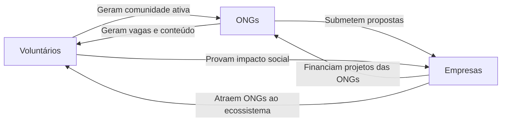

> O modelo só funciona com massa crítica nos três lados. A estratégia de entrada prioriza voluntários e ONGs para validar o efeito de rede antes de abordar empresas.

---

## 2. Propostas de Valor

> *Como você contribui?*

### 2.1 Para Voluntários

| Proposta | Benefício Concreto | Diferencial |
|---|---|---|
| Catálogo geolocalizado | Vagas dentro do raio que o voluntário define | Outros canais não filtram por proximidade real |
| Filtro por categoria e modalidade | Encontrar causas alinhadas a valores pessoais | Busca semântica além de listas genéricas |
| Push notifications | Alertas automáticos de novas vagas | Voluntário não precisa buscar ativamente |
| Histórico consolidado | Horas voluntárias e organizações apoiadas em um perfil | Serve como portfólio e certificação informal |
| PWA offline | Funciona como app, sem instalação na loja | Acessível em qualquer dispositivo e conexão |

### 2.2 Para ONGs

| Proposta | Benefício Concreto | Diferencial |
|---|---|---|
| Captação acelerada | De semanas para horas | Elimina dependência de redes sociais pessoais |
| Voluntários qualificados | Filtragem por interesse, localização e disponibilidade | Fila de candidatos pré-filtrados |
| Acesso a editais | Canal direto para financiamento corporativo | Antes acessível apenas por relacionamento |
| Painel centralizado | Gestão de vagas e candidatos em um lugar | Substitui planilha + WhatsApp + e-mail |
| Relatórios (Premium) | Dados para prestação de contas e planejamento | Exigido por financiadores e redes de ONGs |

### 2.3 Para Empresas

| Proposta | Benefício Concreto | Diferencial |
|---|---|---|
| Edital estruturado | Processo formal com critérios, prazo e submissão organizada | Substitui o caos de receber propostas por e-mail |
| ONGs verificadas | Base de organizações com perfil e histórico validado | Reduz risco reputacional |
| Rastreabilidade | Dashboard de impacto para relatórios ESG e GRI | Evidência auditável de investimento social |
| Visibilidade de marca | Nome da empresa associado a causas aprovadas | Comunicação ESG orgânica |

---

## 3. Canais

> *Como te encontram?*

### 3.1 Funil de Aquisição por Segmento

```mermaid
flowchart TD
    subgraph Voluntários
        V1[Redes Sociais Instagram/TikTok] --> V2[SEO - buscas por voluntariado]
        V2 --> V3[Indicação de outros voluntários]
        V3 --> V4[Cadastro na Plataforma]
    end

    subgraph ONGs
        O1[Prospecção direta outbound] --> O2[Parcerias com redes de ONGs]
        O2 --> O3[Indicação de voluntários satisfeitos]
        O3 --> O4[Onboarding ONG]
    end

    subgraph Empresas
        E1[LinkedIn - conteúdo ESG] --> E2[Indicação de ONGs parceiras]
        E2 --> E3[Eventos de sustentabilidade]
        E3 --> E4[Contato comercial direto]
        E4 --> E5[Contrato de edital]
    end
```

### 3.2 Canais Detalhados

**Redes sociais (Instagram, LinkedIn, TikTok)**
- Instagram: histórias de voluntários, impacto de ONGs, calls-to-action para cadastro
- LinkedIn: conteúdo ESG para alcançar gestores de sustentabilidade e profissionais que buscam voluntariado
- TikTok: vídeos curtos mostrando ações voluntárias (alto potencial viral com custo zero)
- Frequência mínima: 3 posts/semana por canal

**SEO orgânico**
- Páginas de vagas indexadas: `/vagas/sao-paulo/educacao`, `/vagas/belo-horizonte/saude`
- Blog com conteúdo sobre voluntariado, ESG, ODS e terceiro setor
- Escala automaticamente com o crescimento do volume de vagas

**Parcerias institucionais**
- ABONG (Associação Brasileira de ONGs): acesso a rede nacional
- Prefeituras: voluntariado cívico e cidadania
- Universidades: programas de extensão e horas complementares via voluntariado

**Indicação e viralização**
- Programa de convite: voluntário indica ONG/amigo e ambos recebem benefício
- Depoimentos de ONGs e voluntários para prova social nas redes

**Eventos e feiras**
- Eventos de sustentabilidade corporativa (feitos por associações como CEBDS, Instituto Ethos)
- Feiras de voluntariado e terceiro setor

---

## 4. Relacionamento com Clientes

> *Como você interage?*

### 4.1 Jornada do Voluntário

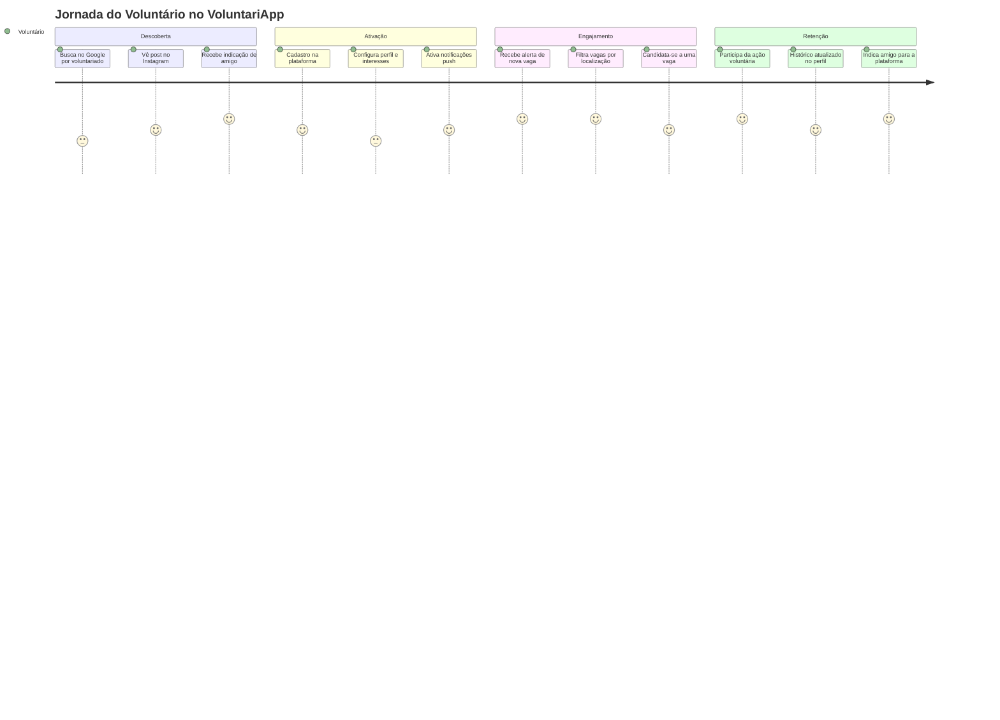

### 4.2 Jornada da ONG

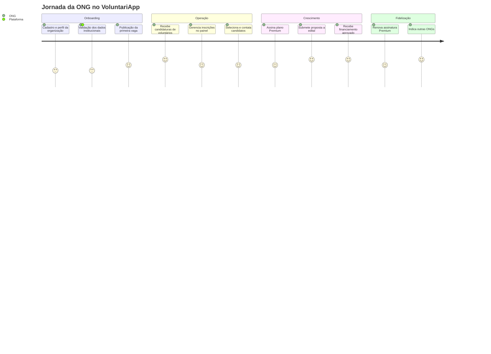

### 4.3 Jornada da Empresa

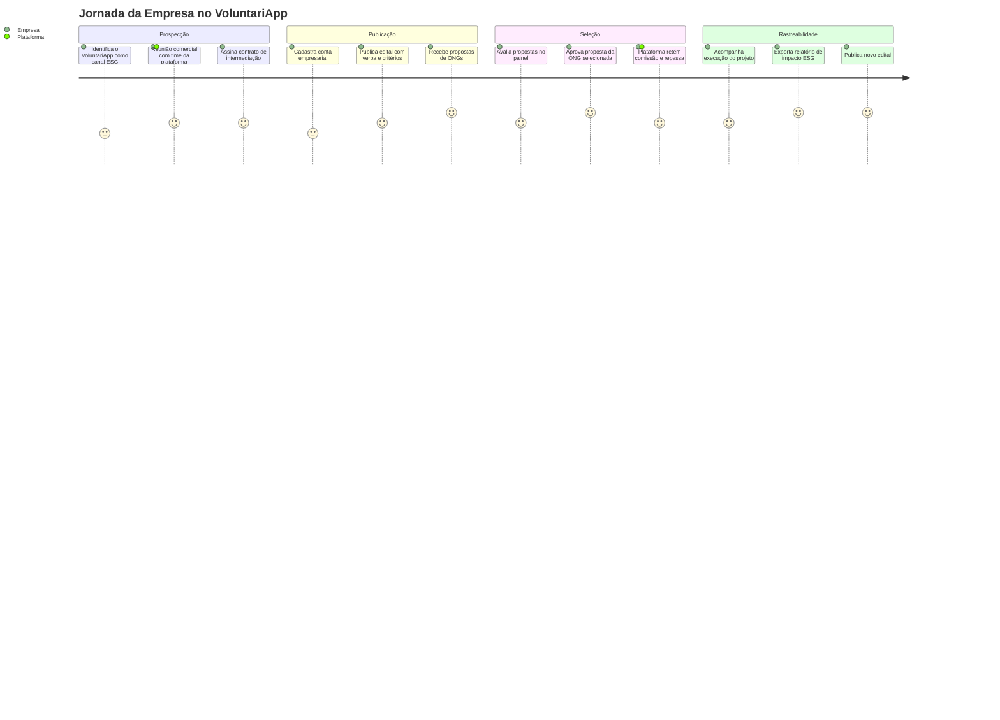

### 4.4 Modelos de Relacionamento

| Segmento | Modelo | Detalhe |
|---|---|---|
| Voluntário | Self-service + Push | Cadastro autônomo; plataforma mantém engajamento via notificações |
| ONG (Free) | Self-service + Suporte básico | Operação autônoma; suporte por chat/e-mail para dúvidas |
| ONG (Premium) | Self-service + Suporte prioritário | Acesso a canais dedicados e onboarding assistido |
| Empresa | Relação comercial | Contato direto com time da plataforma; SLA de atendimento |

---

## 5. Fontes de Receita e Planejamento Financeiro

> *O que você recebe?*

### 5.1 Modelo de Receita

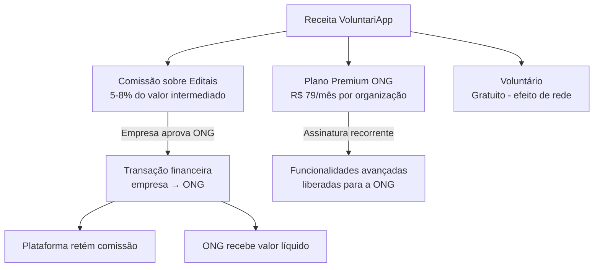

### 5.2 Estrutura de Preços

**Voluntários — Gratuito**
- Todas as funcionalidades essenciais sem custo
- Justificativa: volume de usuários é o ativo que atrai ONGs e empresas

**ONGs — Freemium**

| Plano | Preço | Funcionalidades |
|---|---|---|
| **Free** | R$ 0 | Publicar vagas, receber candidaturas, painel básico |
| **Premium** | R$ 79/mês | + Destaque de vagas, relatórios avançados, múltiplos gestores, acesso antecipado a editais |

**Empresas — Modelo de comissão**

| Faixa do Edital | Comissão |
|---|---|
| Até R$ 50.000 | 8% |
| R$ 50.001 – R$ 200.000 | 6% |
| Acima de R$ 200.000 | 5% (negociável) |

> A estrutura regressiva de comissão incentiva editais de maior valor, que são mais interessantes para todas as partes.

---

### 5.3 Projeções Financeiras

#### Premissas

| Premissa | Valor |
|---|---|
| Valor médio de edital | R$ 120.000 |
| Comissão média aplicada | 6,5% |
| Receita média por edital | R$ 7.800 |
| Preço do plano Premium ONG | R$ 79/mês |
| Churn mensal Premium | 5% |
| Custo de aquisição de ONG (CAC) | R$ 200 |
| Custo de aquisição de empresa (CAC) | R$ 2.500 |

#### Projeção de Usuários (Meses 1–24)

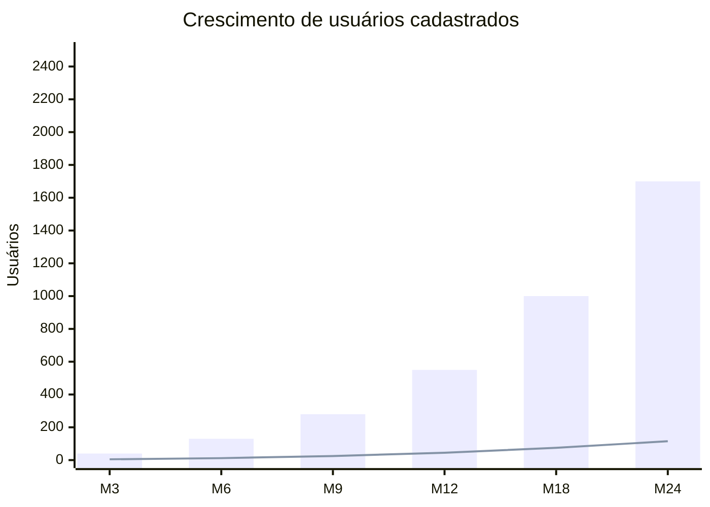

> Barras = Voluntários | Linha = ONGs cadastradas. Crescimento orgânico gradual típico de plataformas B2B/social em estágio inicial.

#### Projeção de Receita — Cenário Base (5 Anos)

| Período | Editais/ano | Receita Editais | ONGs Premium (média) | Receita Premium | **Total** |
|---|---|---|---|---|---|
| **Ano 1** | **2** | **R$ 15.600** | **5** | **R$ 4.740** | **R$ 20.340** |
| **Ano 2** | **5** | **R$ 39.000** | **18** | **R$ 17.064** | **R$ 56.064** |
| **Ano 3** | **12** | **R$ 93.600** | **45** | **R$ 42.660** | **R$ 136.260** |
| **Ano 4** | **22** | **R$ 171.600** | **80** | **R$ 75.840** | **R$ 247.440** |
| **Ano 5** | **35** | **R$ 273.000** | **120** | **R$ 113.760** | **R$ 386.760** |

#### Projeção de Custos (5 Anos)

| Item | Ano 1 | Ano 2 | Ano 3 | Ano 4 | Ano 5 |
|---|---|---|---|---|---|
| Infraestrutura (Vercel + DB + Push) | R$ 2.100 | R$ 6.000 | R$ 14.400 | R$ 25.200 | R$ 40.800 |
| Monitoramento (Sentry/Datadog) | R$ 0 | R$ 600 | R$ 1.800 | R$ 3.600 | R$ 4.800 |
| Desenvolvimento | R$ 0 ¹ | R$ 0 ¹ | R$ 0 ¹ | R$ 0 ¹ | R$ 0 ¹ |
| Customer Success externo (PJ) | R$ 0 | R$ 6.000 | R$ 36.000 | R$ 48.000 | R$ 60.000 |
| Growth / Marketing (pessoa) | R$ 0 | R$ 0 | R$ 0 | R$ 36.000 | R$ 48.000 |
| Product Manager (PJ) | R$ 0 | R$ 0 | R$ 0 | R$ 0 | R$ 36.000 |
| Marketing digital | R$ 3.600 | R$ 15.000 | R$ 24.000 | R$ 36.000 | R$ 48.000 |
| Jurídico / contratos / LGPD | R$ 4.800 | R$ 6.000 | R$ 8.000 | R$ 10.000 | R$ 12.000 |
| Operacional (ferramentas, misc) | R$ 1.800 | R$ 4.800 | R$ 7.200 | R$ 10.800 | R$ 15.000 |
| **Total Custos** | **R$ 12.300** | **R$ 38.400** | **R$ 91.400** | **R$ 169.600** | **R$ 264.600** |

> ¹ Desenvolvimento realizado pelos **4 fundadores-desenvolvedores em regime de equity** — custo-oportunidade não contabilizado no caixa operacional. Contratações externas são progressivas e sempre sustentadas pela receita corrente, sem necessidade de capital externo ou dívida.

#### Resultado Projetado (5 Anos)

| Período | Receita | Custos | **Resultado** | **Margem** |
|---|---|---|---|---|
| Ano 1 | R$ 20.340 | R$ 12.300 | **+R$ 8.040** | +40% |
| Ano 2 | R$ 56.064 | R$ 38.400 | **+R$ 17.664** | +32% |
| Ano 3 | R$ 136.260 | R$ 91.400 | **+R$ 44.860** | +33% |
| Ano 4 | R$ 247.440 | R$ 169.600 | **+R$ 77.840** | +31% |
| Ano 5 | R$ 386.760 | R$ 264.600 | **+R$ 122.160** | +32% |

> Modelo **lucrativo desde o Ano 1**, sustentado pelos 4 fundadores-desenvolvedores que eliminam o principal custo de startups de tecnologia na fase inicial. Os custos escalam proporcionalmente à receita — o time externo só é contratado quando a receita recorrente já financia a posição sem comprometer o caixa.

#### Receita Mensal Estimada — Ano 1

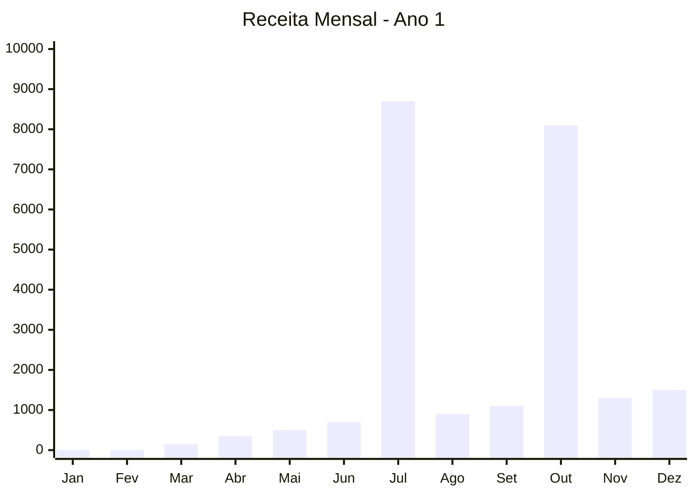

> Receita concentrada nos meses com edital aprovado (picos em Jul e Out). Meses sem edital sustentados por recorrência Premium. Custo operacional médio mensal no Ano 1: ~R$ 1.025 (infra + jurídico + marketing orgânico). Resultado anual estimado: **+R$ 8.040**, viabilizado pelo modelo lean com fundadores-desenvolvedores.

---

### 5.4 Indicadores-Chave de Desempenho (KPIs)

| KPI | Ano 1 | Ano 2 | Ano 3 | Ano 4 | Ano 5 |
|---|---|---|---|---|---|
| Voluntários cadastrados | 800 | 2.200 | 5.000 | 10.000 | 18.000 |
| ONGs ativas | 60 | 150 | 300 | 550 | 800 |
| ONGs Premium | 8 | 25 | 60 | 100 | 140 |
| Editais intermediados | 2 | 5 | 12 | 22 | 35 |
| Volume intermediado (R$) | R$ 240.000 | R$ 600.000 | R$ 1,44M | R$ 2,64M | R$ 4,2M |
| Taxa de conversão voluntário→candidatura | 12% | 18% | 25% | 30% | 35% |
| NPS médio da plataforma | >35 | >45 | >55 | >62 | >70 |
| CAC Voluntário | R$ 20 | R$ 15 | R$ 10 | R$ 8 | R$ 6 |
| CAC ONG | R$ 250 | R$ 180 | R$ 130 | R$ 100 | R$ 80 |
| LTV ONG Premium | R$ 1.422 | R$ 1.738 | R$ 2.054 | R$ 2.212 | R$ 2.370 |

---

## 6. Recursos Principais

> *Quem é você? O que você tem?*

### 6.1 Recursos Tecnológicos

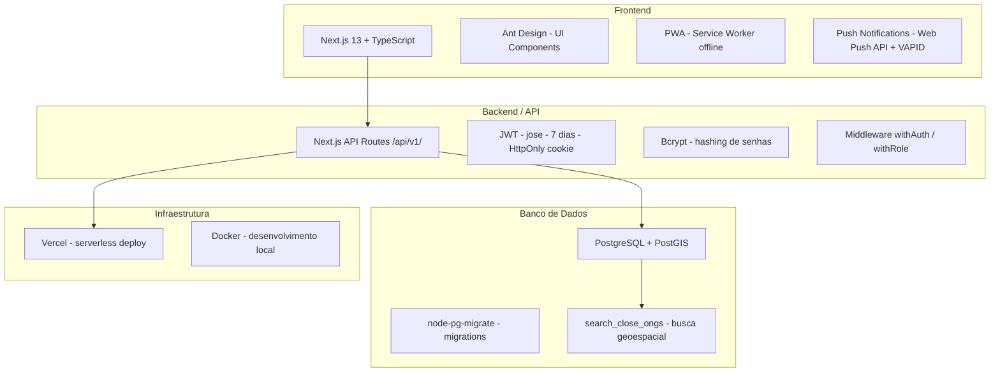

### 6.2 Recursos Humanos

**Equipe fundadora (Ano 1–2)**

A sociedade é composta por **5 fundadores**, sendo **4 aptos ao desenvolvimento técnico** do produto. Este é o principal diferencial de capital da empresa: elimina o custo dominante de startups de tecnologia na fase de validação.

| Papel | Qtd | Responsabilidade |
|---|---|---|
| Fundadores Desenvolvedores | 4 | Desenvolvimento full-stack, manutenção, novas features, migrations e DevOps |
| Fundador Gestor | 1 | Estratégia, comercial com empresas, parcerias com ONGs |

> Nos Anos 1 e 2, todos os custos de desenvolvimento são cobertos pelos fundadores em regime de equity. Isso permite que a empresa seja lucrativa desde o primeiro ano sem necessidade de investimento externo.

**Primeiras contratações externas (Ano 3 — financiadas pela receita)**

| Papel | Responsabilidade |
|---|---|
| Customer Success (PJ) | Onboarding de ONGs, suporte premium, retenção de assinantes |
| Growth / Marketing (PJ) | Aquisição orgânica, conteúdo, SEO, campanhas |

**Equipe em escala (Ano 4–5 — crescimento via receita recorrente)**

| Papel | Responsabilidade |
|---|---|
| Customer Success Sênior (CLT) | Gestão de contas de empresas e ONGs Premium |
| Growth Sênior (CLT) | Parcerias estratégicas, expansão para novas cidades |
| Product Manager (PJ) | Roadmap, priorização, métricas de produto |

### 6.3 Recursos Intangíveis

| Ativo | Descrição | Valor estratégico |
|---|---|---|
| Dados de geolocalização | Perfis georeferenciados de ONGs e voluntários | Melhora matching continuamente — difícil de replicar |
| Base de vagas e candidaturas | Prova de tração para atrair empresas | Reduz o risco percebido de novos editais |
| Posicionamento ODS 17 | Ancoragem em agenda global da ONU | Diferencial de credibilidade institucional |
| Reputação com ONGs early adopters | Prova social para captação de novas organizações | Reduz CAC e acelera crescimento B2B |

---

## 7. Atividades-Chave

> *O que você faz?*

### 7.1 Fluxo de Matching Voluntário–Vaga

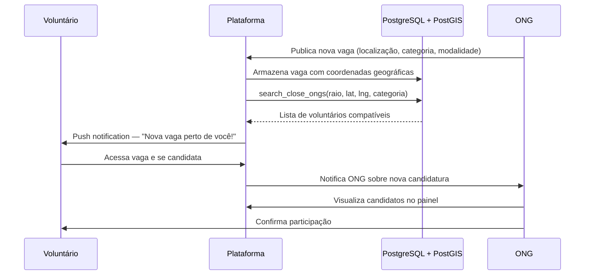

### 7.2 Fluxo de Edital Empresa → ONG

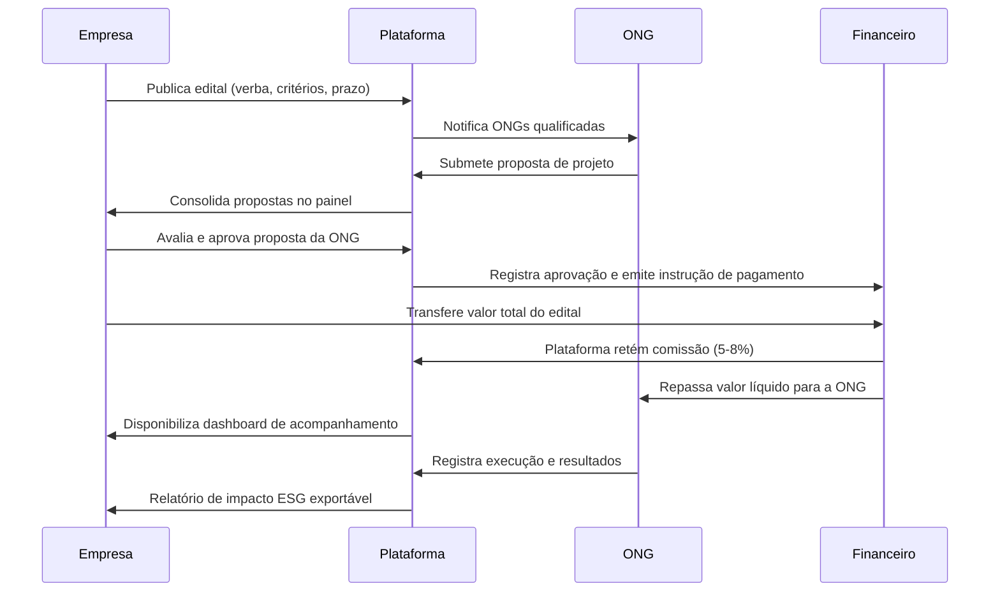

### 7.3 Ciclo de Desenvolvimento do Produto

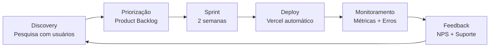

---

## 8. Parcerias Principais

> *Quem o ajuda?*

### 8.1 Mapa de Parcerias

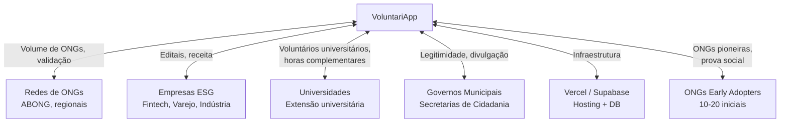

### 8.2 Critérios de Seleção e Estratégia por Tipo de Parceiro

**ONGs Early Adopters (prioridade máxima — fase atual)**
- Critério: ONGs com processo ativo de captação de voluntários, abertas a feedback
- Abordagem: prospecção direta, onboarding gratuito permanente, co-criação de features
- Meta: 10 ONGs ativas nos primeiros 3 meses

**Empresas privadas (prioridade alta — meses 4–9)**
- Critério: empresas com orçamento ESG definido, estrutura de sustentabilidade ou RSC
- Abordagem: LinkedIn outbound + indicação de ONGs parceiras + eventos do setor
- Meta: 1 empresa com edital publicado até o mês 6

**Redes de ONGs (prioridade média — meses 6–12)**
- Critério: redes com 20+ organizações membros, interesse em digitalização
- Abordagem: proposta de parceria com benefícios para membros (plano premium com desconto)
- Meta: 1 parceria de rede assinada até o mês 12

**Universidades (prioridade secundária — ano 2)**
- Critério: cursos com programa de extensão ou horas complementares
- Abordagem: proposta de integração — voluntariado validado como horas complementares via VoluntariApp
- Benefício: fluxo constante de voluntários jovens e engajados

---

## 9. Estrutura de Custos

> *O que você oferece e o que custa?*

### 9.1 Detalhamento de Custos por Categoria

**Infraestrutura tecnológica**

| Item | Plano atual | Escala (Ano 2) | Escala (Ano 3) |
|---|---|---|---|
| Vercel (hosting + functions) | ~R$ 50/mês | ~R$ 300/mês | ~R$ 600/mês |
| PostgreSQL + PostGIS (gerenciado) | ~R$ 150/mês | ~R$ 350/mês | ~R$ 700/mês |
| Web Push (Notifications) | ~R$ 50/mês | ~R$ 150/mês | ~R$ 400/mês |
| Domínio + SSL | ~R$ 50/ano | ~R$ 50/ano | ~R$ 50/ano |
| Monitoramento (Sentry/Datadog) | R$ 0 (free) | ~R$ 100/mês | ~R$ 200/mês |

**Desenvolvimento**

| Item | Descrição |
|---|---|
| Custo dominante | Horas de engenharia — funcionalidades novas, manutenção, segurança, migrations |
| Fase MVP | 1 dev full-stack dedicado |
| Fase de crescimento | 2-3 devs + PM |
| Prioridades atuais | Módulo completo de empresa/editais, testes automatizados, performance de busca geoespacial |

**Marketing e Crescimento**

| Canal | Custo estimado | ROI esperado |
|---|---|---|
| Produção de conteúdo (redes sociais) | R$ 800–1.500/mês | CAC voluntário < R$ 15 |
| SEO técnico (otimização de páginas de vagas) | R$ 500/mês (1× setup) | Tráfego orgânico crescente |
| Tráfego pago (Google/Meta) | R$ 500–2.000/mês (eventual) | Testar canais, escalar o que funciona |
| Eventos e feiras ESG | R$ 500–1.500/evento | Pipeline de empresas |

**Jurídico e Operacional**

| Item | Descrição |
|---|---|
| Contratos de intermediação | Modelo jurídico para relação empresa–plataforma–ONG (responsabilidades, repasse, comissão) |
| Termos de uso e privacidade | LGPD compliance para dados de usuários (nome, localização, dados da ONG) |
| Constituição da empresa | CNPJ, enquadramento tributário (Simples Nacional ou Lucro Presumido) |
| Tributação sobre comissões | Análise do regime adequado para receita de intermediação |

---

## 10. Planejamento Estratégico e Roadmap

### 10.1 Fases de Desenvolvimento

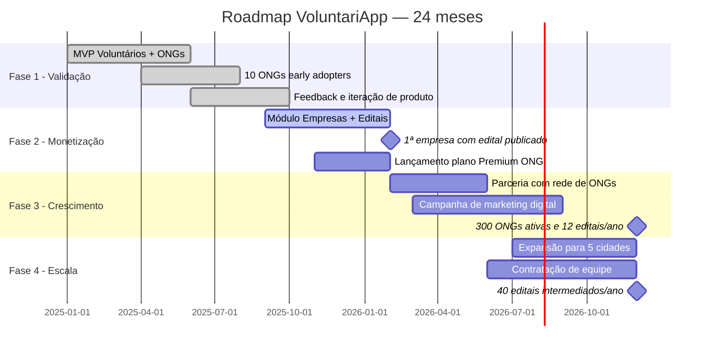

### 10.2 Prioridades por Fase

**Fase 1 — Validação (concluída/em curso)**
- [x] Plataforma funcional para voluntários e ONGs
- [x] Matching geolocalizado com PostGIS
- [x] Sistema de candidaturas e gestão de vagas
- [ ] 10 ONGs ativas com vagas publicadas
- [ ] 500 voluntários cadastrados

**Fase 2 — Monetização (prioridade atual)**
- [ ] Módulo completo de empresas e editais (publicação, submissão, aprovação)
- [ ] Fluxo financeiro de repasse e retenção de comissão
- [ ] Plano Premium para ONGs com cobrança recorrente
- [ ] Primeiro edital publicado e intermediado

**Fase 3 — Crescimento (meses 9–18)**
- [ ] 1 parceria com rede de ONGs (20+ organizações)
- [ ] Dashboard de impacto ESG para empresas
- [ ] Programa de indicação ativo
- [ ] SEO com 100+ páginas de vagas indexadas

**Fase 4 — Escala (meses 18–24)**
- [ ] Cobertura de 5 grandes cidades
- [ ] Equipe dedicada (dev, growth, CS)
- [ ] Integração com sistemas de gestão de ONGs (SINED, etc.)
- [ ] 40+ editais/ano intermediados

---

## 11. Análise de Riscos

### 11.1 Matriz de Riscos

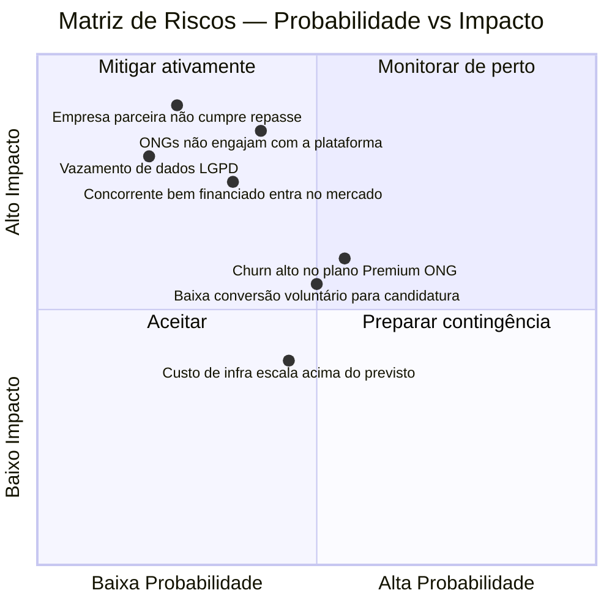

### 11.2 Riscos e Mitigações Detalhados

| Risco | Probabilidade | Impacto | Mitigação |
|---|---|---|---|
| ONGs não engajam na plataforma | Alta | Alto | Onboarding assistido + co-criação de features com early adopters |
| Empresa não honra compromisso financeiro | Baixa | Crítico | Contrato com cláusula de garantia + escrow do valor antes do repasse |
| Concorrente com recursos superiores | Média | Alto | Foco em nichos locais, relacionamento próximo e dados proprietários |
| Violação de dados / LGPD | Baixa | Alto | Auditoria de segurança, criptografia de dados sensíveis, política de privacidade robusta |
| Baixa conversão voluntário → candidatura | Alta | Médio | Testes A/B no funil, melhoria de UX, personalização de notificações |
| Churn alto no Premium | Média | Médio | Onboarding de sucesso, reports de valor mensal, suporte proativo |
| Dependência de infraestrutura Vercel | Média | Médio | Plano de contingência com AWS/Fly.io; arquitetura agnóstica |

---

## 12. Análise Competitiva

### 12.1 Posicionamento de Mercado

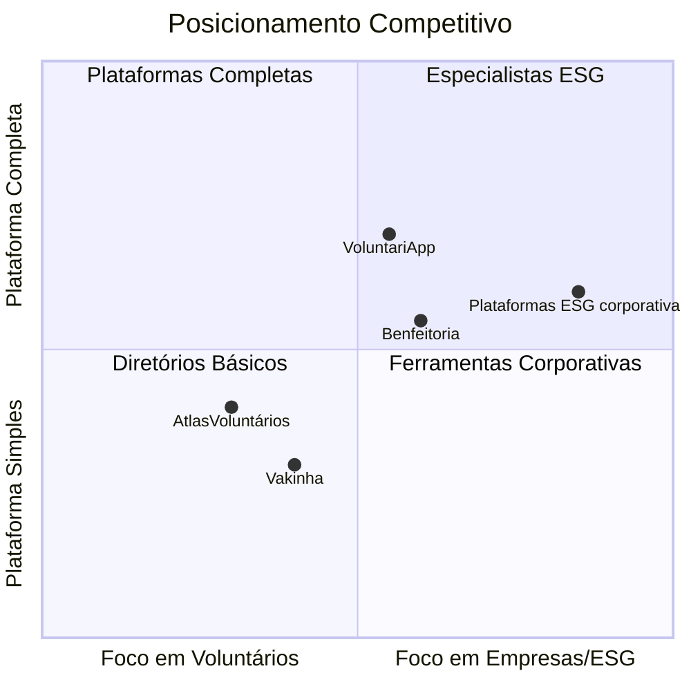

### 12.2 Diferenciais Competitivos

| Diferencial | VoluntariApp | Concorrentes típicos |
|---|---|---|
| Matching geolocalizado (PostGIS) | ✅ Raio configurável em tempo real | ❌ Filtro manual por cidade |
| PWA offline | ✅ Funciona sem internet | ❌ Web only com conexão |
| Intermediação de editais financeiros | ✅ Modelo estruturado empresa→ONG | ❌ Apenas doações diretas |
| Push notifications | ✅ Alertas em tempo real | ❌ E-mail ou sem notificação |
| ODS 17 como posicionamento | ✅ Ancoragem institucional | ❌ Posicionamento genérico |
| Gratuidade para voluntários | ✅ Zero fricção | Variável |

---

## 13. Síntese Estratégica

| Bloco | Resumo | Status |
|---|---|---|
| **Segmentos** | Voluntários (volume/rede), ONGs (proposta central), Empresas (receita) | Definido |
| **Público-Alvo** | Voluntários 18–35 anos mobile-first; ONGs pequeno/médio porte; empresas com agenda ESG | Validado |
| **Proposta de Valor** | Geolocalização, redução de fricção, canal ESG estruturado | Implementado |
| **Canais** | Redes sociais, SEO, parcerias, indicação | Em construção |
| **Relacionamento** | Self-service + push + comercial direto para empresas | Ativo |
| **Receita** | Comissão editais (principal) + Premium ONG (recorrente) | Em desenvolvimento |
| **Financeiro** | Lucrativo desde o Ano 1 (4 fundadores-devs = zero custo de desenvolvimento em caixa); margem estável ~32% ao longo dos 5 anos | Projetado |
| **Recursos** | Next.js + PostgreSQL/PostGIS + Vercel + Web Push | Operacional |
| **Atividades** | Matching, gestão de vagas, intermediação de editais, notificações | Ativas |
| **Parcerias** | Early adopters sendo captados; empresas ESG = próximo passo | Em andamento |
| **Custos** | Dominados por desenvolvimento; infra escalável com Vercel | Controlado |
| **Riscos** | Engajamento de ONGs e conversão de empresas como riscos críticos | Monitorados |

---
